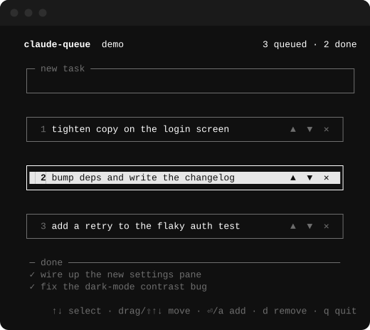

# claude-queue

Queue follow-up tasks for a running Claude Code session — in a clickable, draggable
terminal task list.



Fire off your first task, then pop open a small second-terminal UI and start adding more.
Claude finishes what it's working on, then **automatically picks up the next queued task**,
draining the list one item at a time until it's empty. Nothing interrupts the task in
progress — items are only pulled once the current one is done.

```
  ┌──────────────────────────┐         writes / edits        ┌──────────────────────┐
  │  Main Claude Code session │                               │  Second terminal     │
  │                           │     ┌───────────────────┐     │  window (the UI)     │
  │  /claude-queue ───────────┼────▶│ queue-<sid>.json  │◀────┤  clickable task list │
  │  (opens the UI)           │     │  { queue, done }  │     │  add / remove / move │
  │                           │     └───────────────────┘     └──────────────────────┘
  │  Stop hook ◀──── reads ───┼──── pops head → "do this next"
  └──────────────────────────┘
```

## How it works

Claude Code fires a **`Stop` hook** every time Claude finishes a turn. claude-queue's
hook reads your session's queue file and, if there's a pending task, returns
`{"decision": "block", "reason": "Next queued task: …"}`. That tells Claude not to go idle
and to work on that task next. When the queue is empty, the hook does nothing and the
session idles as usual. The queue strictly shrinks (one item per finished turn), so it
always terminates — no runaway loops.

The terminal UI and the hook share one file per session
(`~/.claude-queue/queue-<session_id>.json`), written atomically so they never collide.

## Install

claude-queue is distributed as a Claude Code plugin from this repo (which doubles as a
marketplace):

```
/plugin marketplace add robzilla1738/claude-queue
/plugin install claude-queue@claude-queue
```

Then restart Claude Code so the `Stop` hook loads.

**Requirements:** Node.js (already required by Claude Code) and macOS or Linux. The UI's
one dependency (`blessed`) is installed automatically the first time you open the queue.

## Usage

1. Give Claude a task as normal.
2. Run **`/claude-queue`** — a new terminal window opens with the task list.
3. Type tasks into the input box (Enter to add). Add as many as you like, whenever you like.
4. When Claude finishes its current task, it pulls the top item off your queue and starts
   on it — then the next, and the next, until the queue is empty.

If you're in a remote/SSH/web session where a window can't be opened, `/claude-queue`
prints the exact `node …/ui/queue-ui.js <session>` command to run in any terminal instead.

### The UI

A minimal, black-and-white list. Each queued task is its own box; the selected
box is inverted (black on white), and the box under your cursor brightens so you
can see what a click will hit. The current task in progress is item 1 — Claude
takes from the top.

| Action | Mouse | Keys |
| --- | --- | --- |
| Add a task | type in the **new task** box, click away | type + **Enter** |
| Select a task | click its box | **↑/↓** or **j/k** |
| Reorder | **drag a box up / down**, or click its **▲ / ▼** | **Shift+↑/↓** |
| Edit a task | **double-click its box** | **e** (Enter saves, Esc cancels) |
| Remove a task | click the **✕** handle on the box | **d** / **⌫** |
| Jump to top / bottom | — | **g** / **G** (or Home / End) |
| Jump to the input | click the **new task** box | **a** / **i** |
| Quit (queue keeps running) | — | **q** / **Esc** / **Ctrl-C** |

Drag-to-reorder needs a terminal that reports mouse motion (Terminal.app, iTerm2
and the rest of the xterm family all do); anywhere else, the ▲ / ▼ handles and
Shift+↑/↓ do the same job.

Consumed tasks drop into a dim **done** strip at the bottom so you can see what
Claude has already picked up.

## Layout

```
.claude-plugin/plugin.json        # plugin manifest
.claude-plugin/marketplace.json   # makes this repo installable as a marketplace
commands/claude-queue.md          # the /claude-queue command (opens the UI)
hooks/hooks.json                  # registers the Stop hook
scripts/stop-hook.js              # Stop hook: pop next task, tell Claude to continue
scripts/launch-queue.sh           # opens the default terminal + starts the UI
scripts/lib/queue-store.js        # shared, atomic per-session queue file logic
ui/queue-ui.js                    # the blessed terminal task list
ui/layout.js                      # pure row/handle geometry + the drag state machine
test/                             # node:test units + hook integration + tmux smoke test
docs/                             # README screenshot + the script that regenerates it
```

## Development

```
node --test test/*.test.js     # run the test suite
bash test/tmux-smoke.sh        # drive the real UI in tmux: keys, clicks, drags, hover
(cd ui && npm install)         # install the UI dependency for local runs
node ui/queue-ui.js my-session # run the UI standalone against a session id
bash docs/make-screenshot.sh   # regenerate the README screenshot from the live UI
```

Queues live in `~/.claude-queue/`. Delete that folder any time to clear all queues, or set
`CLAUDE_QUEUE_DIR` to store them elsewhere.

## Notes & limitations

- macOS (Terminal.app / iTerm2 / Ghostty) and Linux (`$TERMINAL`, `x-terminal-emulator`,
  `gnome-terminal`, `konsole`, `kitty`, `alacritty`, `xterm`, …) are supported. Windows
  Terminal is not yet handled — contributions welcome.
- Queues are scoped per session id, so multiple concurrent sessions stay independent.

## License

MIT — see [LICENSE](./LICENSE).
